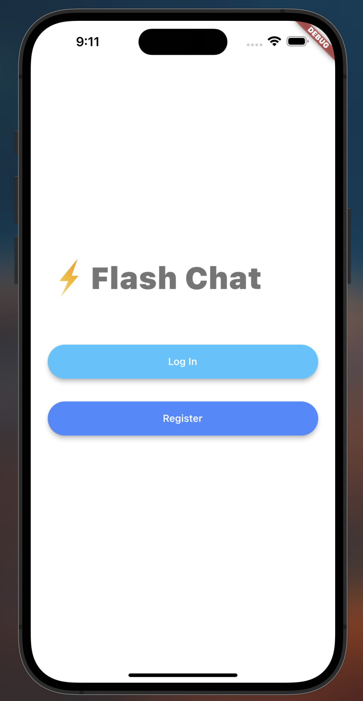
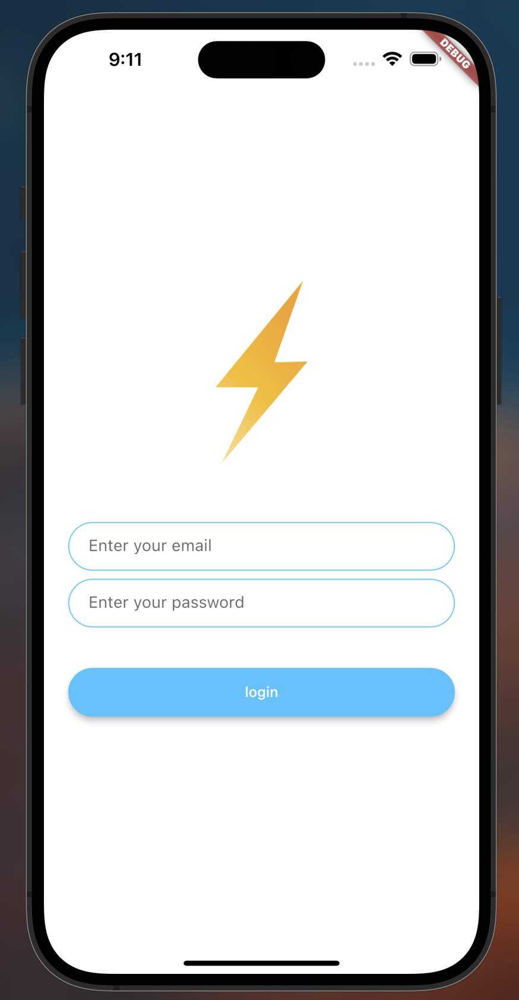
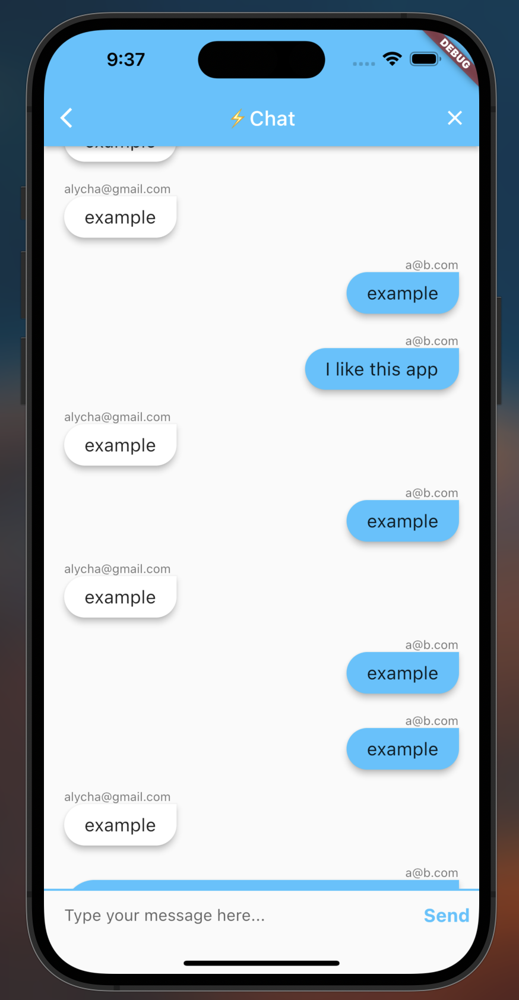

# Flash Chat ⚡️

A messaging app where users can sign up and log in to chat.

In this project, I learned:
- How to incorporate Firebase into Flutter projects.
- How to use Firebase authentication to register and sign in users.
- How to create animations using the Flutter Hero widget.
- How to create custom aniamtions using Flutter's animation controller. 
- Mixins and how they differ from superclasses.
- Streams.
- ListViews to build scrolling views.
- How to use Firebase Cloud Firestore to store and retrieve data

  
&nbsp; &nbsp; &nbsp; &nbsp;
  
&nbsp; &nbsp; &nbsp; &nbsp;
  

